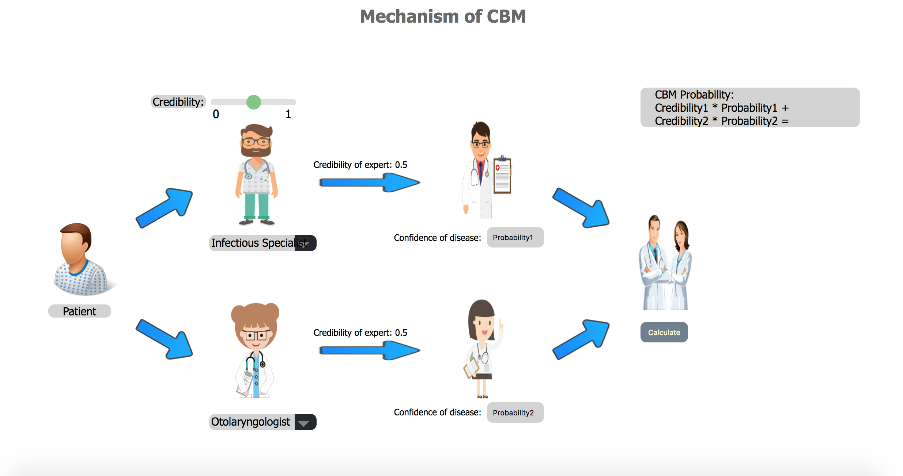
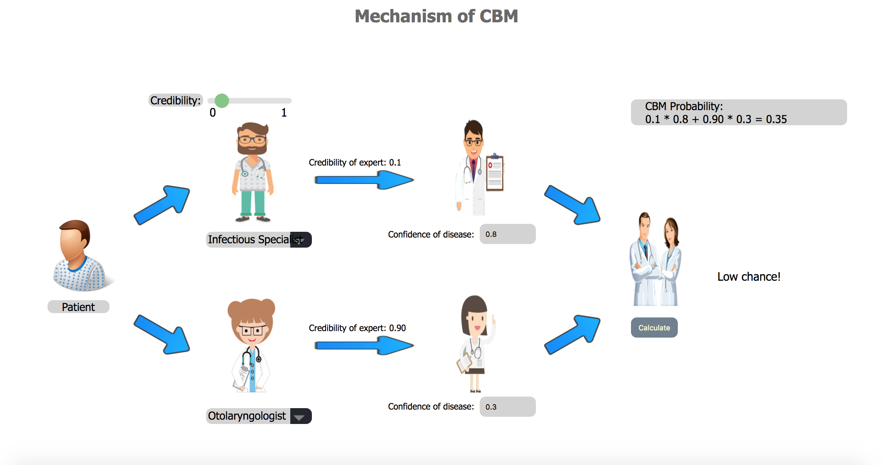

# CBMGraph
The project is implemented using Node.js with express module and is rendered as html using ejs.

## The initial interface

## The interface after draging the range slider and giving respective confidence of disease 

